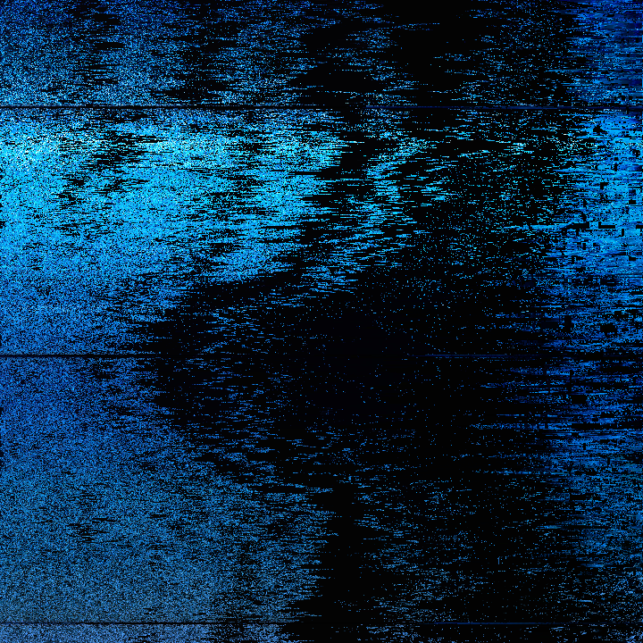

# Pixel Glitch
A pixel sorting library.  Sorts pixels in an image based on input parameters and saves intermediate steps in the sort process as separate images that can then be used to create a video or gif.

**Note:** this library is still under development and not all planned features are available.

## Examples

| Original                  |  Sorted                               | Sorted                                       |
|:-------------------------:|:--------------------------------------|:---------------------------------------------|
|                           | `pixel-glitch images/profile.png`     | `pixel-glitch images/profile.png --reverse`  |
|    |         |       |
|                           | `pixel-glitch images/monterey.png`    | `pixel-glitch images/monterey.png --reverse` |
|   |        |      |
|                           | `pixel-glitch images/sunset.png`      | `pixel-glitch images/sunset.png --reverse`   |
|     |          |        |

## Compiling
```bash
make compile
```
## Running
```bash
pixel-glitch images/profile.png
```

## CLI Options
Available features are emboldened in the table below.

| CLI Arg     | Examples | Description     |
| :---        |    :----   |          ---: |
|  |  |  |
| --algorithm | Sorting algorithm to use.   | [`bubblesort`, `heapsort`, `insertionsort`, **`introsort`**, `mergesort`, `quicksort`]       | 
| --angle     | The angle to sort at.  Only used for `--shape line`     |[`0`, `90`, `235`]        | 
| --percent   | The sort percent to stop at.      |[**`100`**, `50`]        | 
| --reverse   | Reverses the sort direction. |        | 
| --segment   | Will segment the image and sort each segment separately. |        | 
| --shape     | The shape to follow when sorting.  `equation` allows for generic functions to be used in the form of `y = f(x)`  | [**`line`**, `circle`, `equation`] | 
| --value     | The value to use for sorting.  If `auto` will attempt to choose the most "distinct" value. | [`r`, `rg`, `rgba`, `auto`] | 